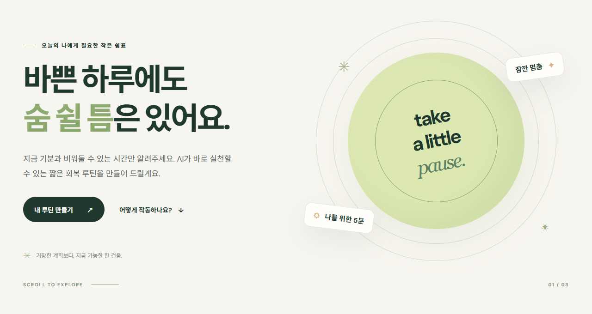
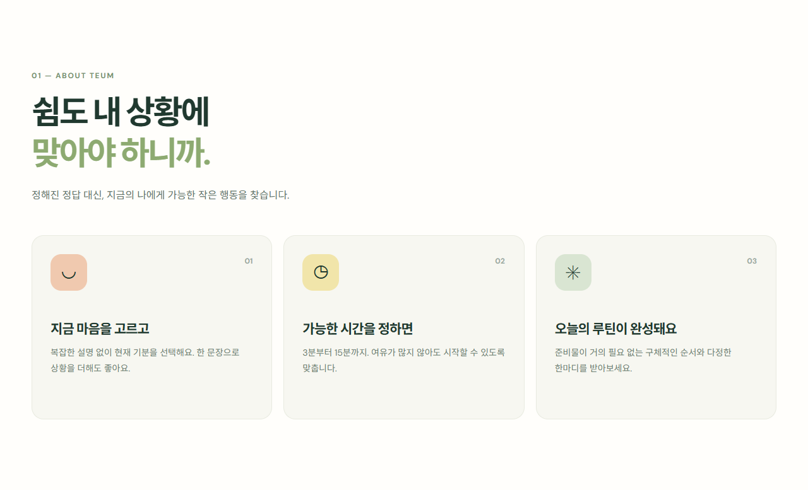
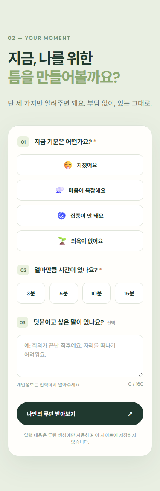
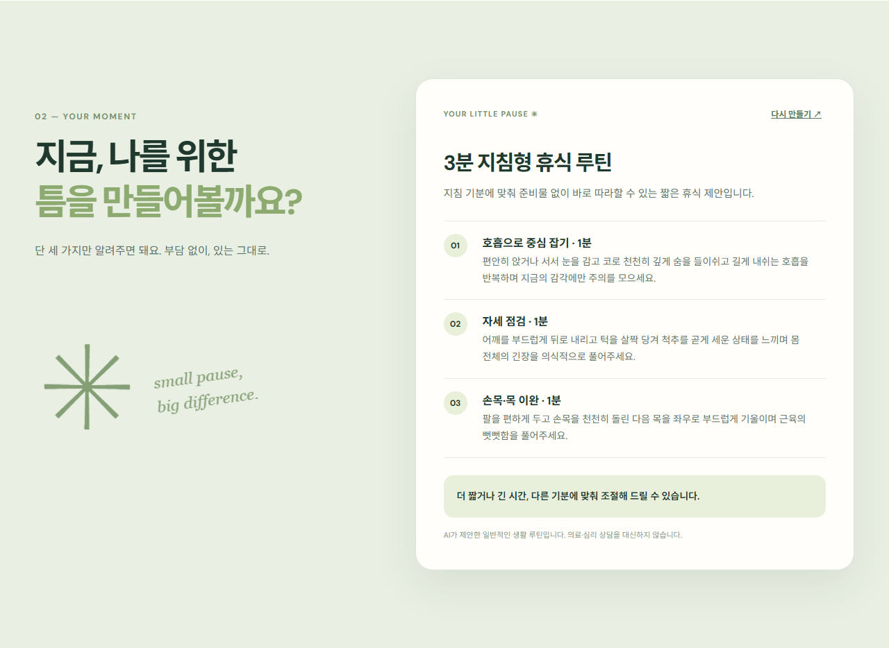
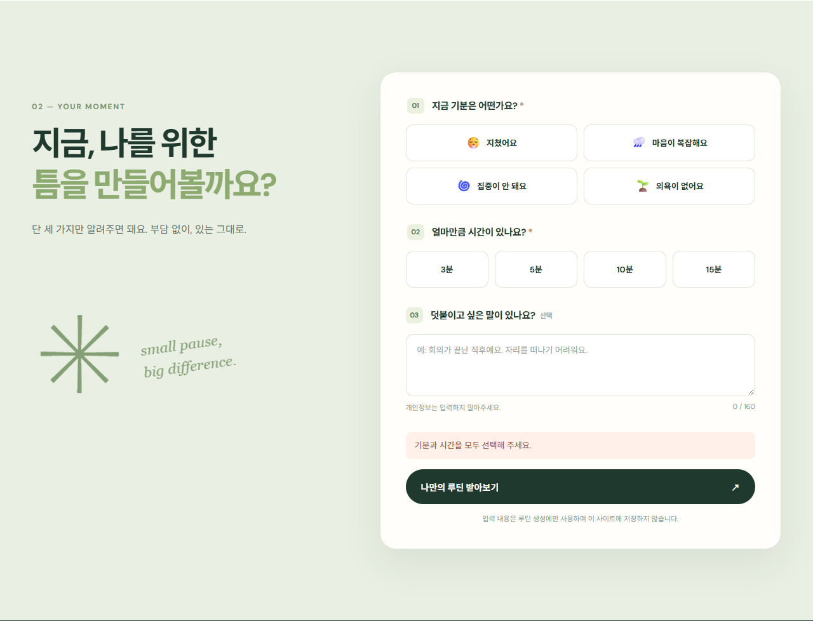
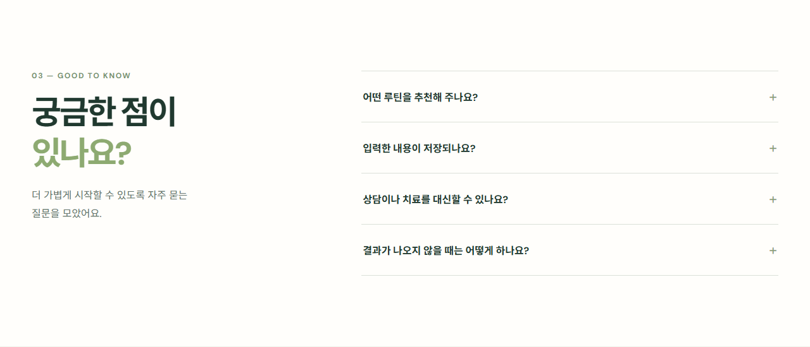

# 틈 — 잠깐 멈추고, 다시 시작하기

**지금 기분과 남은 시간을 입력하면 AI가 바로 실행할 수 있는 2~3단계 회복 루틴을 만들어 주는 웹 서비스**입니다. 긴 휴식을 내기 어려운 학생과 직장인을 위해 가입 없이 사용할 수 있도록 만들었습니다.

## 평가자용 바로가기

| 확인할 내용 | 링크 |
| --- | --- |
| 실제 작동하는 서비스 | **[틈 운영 사이트](https://codyssey-a1-3-nine.vercel.app/)** |
| 전체 소스와 커밋 기록 | [GitHub 저장소](https://github.com/highslow1536/Codyssey-A1-3) · [커밋 기록](https://github.com/highslow1536/Codyssey-A1-3/commits/main/) |
| 기획 의도·대상·화면·AI 흐름 | [서비스 기획서](docs/PLAN.md) |
| AI를 활용한 구현과 오류 수정 과정 | [AI 작업 기록](docs/AI_WORK_LOG.md) |
| 운영 화면 증빙 | [데스크톱 전체 화면](docs/evidence/desktop.png) · [모바일 전체 화면](docs/evidence/mobile.png) · **[실제 AI 결과 화면](docs/evidence/ai-result.png)** |

## 화면으로 먼저 보기

아래 이미지는 모두 [운영 사이트](https://codyssey-a1-3-nine.vercel.app/)를 브라우저에서 직접 캡처했습니다. 이미지를 누르면 원본 크기로 볼 수 있습니다.

### 1. 첫 화면

[](docs/evidence/hero.png)

### 2. 서비스 소개와 사용 순서

[](docs/evidence/features.png)

### 3. 모바일 입력과 실제 AI 결과

| 모바일 입력 화면 | 실제 Copa AI 생성 결과 |
| --- | --- |
| [](docs/evidence/mobile-form.png) | [](docs/evidence/ai-result.png) |

### 4. 필수 입력 안내와 FAQ

[](docs/evidence/validation.png)

[](docs/evidence/faq.png)

[데스크톱 페이지 전체 보기](docs/evidence/desktop.png) · [모바일 페이지 전체 보기](docs/evidence/mobile.png)

## 미션 조건별 확인 경로

| 조건 | 구현·증빙 |
| --- | --- |
| 3개 이상 구획과 메뉴 이동 | 운영 사이트의 히어로 → 소개 → 루틴 만들기 → FAQ. [화면 코드](index.html) |
| 반응형 화면 | 1280px [데스크톱](docs/evidence/desktop.png), 375px [모바일](docs/evidence/mobile.png) 캡처. [스타일 코드](css/style.css) |
| 실제 AI 입력과 결과 | 기분·시간·상황 입력 후 단계별 루틴 출력. [운영 결과 캡처](docs/evidence/ai-result.png) · [화면 동작 코드](js/app.js) |
| Python Vercel Serverless API | [`api/routine.py`](api/routine.py) · [Vercel 설정](vercel.json) |
| 기획서·README·AI 작업 과정 | [기획서](docs/PLAN.md) · 현재 README · [작업 기록](docs/AI_WORK_LOG.md) |

AI 작업 기록에는 실제 구현·테스트·수정 사항과 연결된 Git 커밋을 정리했습니다. **Codex 대화 화면 원본 캡처는 공개 저장소에 포함하지 않았으므로, 평가 과정에서 대화 화면 자체를 요구한다면 별도로 제출해야 합니다.**

## 서비스 사용 흐름

1. 상단 **루틴 만들기**로 이동합니다.
2. 현재 기분(지침·불안·산만·무기력)과 가능한 시간(3·5·10·15분)을 선택합니다. 상황 설명은 선택이며 최대 160자입니다.
3. **나만의 루틴 받아보기**를 누르면 결과 제목, 안내, 소요 시간이 표시된 2~3개 행동과 마무리 문장이 나타납니다. 다시 만들기도 가능합니다.

필수 입력 누락, 서버 오류, 연결 실패, 시간 초과를 화면에 안내합니다. 서비스는 일상 루틴 아이디어를 제공하며 의료·심리 상담을 대신하지 않습니다. 입력 내용과 생성 결과를 사이트 데이터베이스에 저장하지 않습니다.

## AI 연결과 코드 구조

| 영역 | 역할 | 파일 |
| --- | --- | --- |
| HTML/CSS | 화면·메뉴·반응형 레이아웃 | [index.html](index.html), [css/style.css](css/style.css) |
| JavaScript | 입력 검사 → `fetch('/api/routine')` → 결과·오류 표시 | [js/app.js](js/app.js) |
| Python Vercel Function | 입력 재검사, Copa AI 호출, JSON 결과·시간 합 검증 | [api/routine.py](api/routine.py) |
| 배포 설정 | 정적 화면과 파일 기반 Python 함수를 함께 배포 | [vercel.json](vercel.json), [requirements.txt](requirements.txt) |

백엔드는 Codyssey Copa의 `https://copa.codyssey.kr/v1/chat/completions`에 Chat Completions 형식으로 요청합니다. Vercel 환경 변수 **`OPENAI_API_KEY`에는 Copa virtual key**, **`MODEL`에는 모델명**을 넣습니다(기본값 `gpt-5-mini`). 키는 브라우저 코드와 저장소에 포함하지 않습니다. [환경 변수 예시](.env.example)

`POST /api/routine`의 요청 예시:

```json
{"mood":"지침","minutes":3,"context":"잠시 쉬고 싶어요"}
```

성공 응답의 `routine`에는 `title`, `intro`, `steps`(`title`, `minutes`, `description`), `closing`이 들어갑니다. 서버는 단계 2~3개의 시간 합이 선택한 시간과 일치하는지 검사합니다. 잘못된 입력은 400, AI 서비스 실패는 502/503, 연결 지연은 504로 처리합니다.

## 실제 검증 결과

- 운영 URL의 HTML·CSS·JavaScript·아이콘: **200** 확인
- 운영 API에 `지침`·`3분` 요청: **200**, 3단계의 소요 시간 합 **3분** 확인
- 실제 브라우저 결과 표시: [AI 결과 캡처](docs/evidence/ai-result.png)
- 1280px·375px Chrome 화면에서 가로 넘침, 필수 입력 안내, 결과 표시, 다시 만들기 확인
- Python 단위 테스트 **3건 통과**: [테스트 코드](tests/test_routine.py). 브라우저 확인 코드: [화면 테스트](tests/browser_smoke.cjs), [실제 결과 캡처](tests/capture_live_result.cjs)

AI가 작성한 초안을 그대로 두지 않고, Vercel 진입점 오류·API 제공자 불일치·결과의 시간 중복 표시를 수정했습니다. 관련 변경은 [배포 설정 수정](https://github.com/highslow1536/Codyssey-A1-3/commit/c76109fb23ebef9e24ef5a595cb376f2440a105f), [Copa API 전환](https://github.com/highslow1536/Codyssey-A1-3/commit/ebec752cd6af852087195e49366c18c751f00a24), [시간 표시 수정](https://github.com/highslow1536/Codyssey-A1-3/commit/4681accbbedc2d012c9af863c6862ed0395ce5ed)에서 확인할 수 있습니다.

## 로컬 실행과 재배포

Python 3.12 이상에서 프로젝트 루트에서 `python3 dev_server.py`를 실행하고 `http://localhost:8000`을 엽니다. 실제 AI 생성에는 서버 환경 변수 `OPENAI_API_KEY`가 필요합니다. 검증은 `python3 -m unittest discover -s tests -v`로 실행합니다.

배포는 GitHub `main` 브랜치와 Vercel을 연결해 자동으로 진행합니다. Vercel 프로젝트의 **Settings → Environment Variables**에서 `OPENAI_API_KEY`와 필요 시 `MODEL`을 설정합니다. 환경 변수를 변경했다면 재배포해야 새 값이 적용됩니다. 키 값은 코드, 문서, 캡처에 넣지 마세요.
